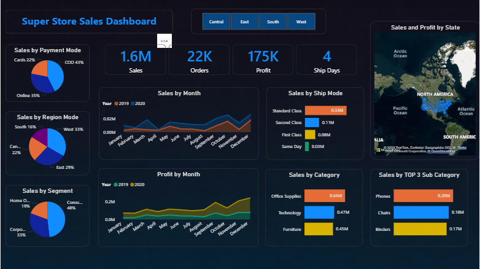

# 📊 Sales Analysis

*Analyzing sales performance, delivery efficiency, and return behavior to support data-driven business decisions using Power BI.*

## Project Workflow
Raw Data -> Data Cleaning(Powerbi) -> Feature Engineering(DAX) -> Data Analysis -> Power BI Dashboard -> Business Insights & Recommendations

## 📌 Table of Contents

* <a href="#overview">Overview</a>
* <a href="#business-problem">Business Problem</a>
* <a href="#dataset">Dataset</a>
* <a href="#tools--technologies">Tools & Technologies</a>
* <a href="#project-structure">Project Structure</a>
* <a href="#data-cleaning--preparation">Data Cleaning & Preparation</a>
* <a href="#exploratory-data-analysis-eda">Exploratory Data Analysis (EDA)</a>
* <a href="#dashboard">Dashboard</a>
* <a href="#key-insights">Key Insights</a>
* <a href="#how-to-run-this-project">How to Run This Project</a>
* <a href="#final-recommendations">Final Recommendations</a>
* <a href="#author--contact">Author & Contact</a>


---

<h2><a class="anchor" id="overview"></a>Overview</h2>

This project analyzes sales transactions to understand revenue trends, delivery performance, and return behavior. The goal is to identify key drivers of sales performance and operational efficiency using an interactive Power BI dashboard.

The analysis helps businesses monitor sales growth, optimize delivery timelines, and reduce product returns to improve overall profitability.

---

<h2><a class="anchor" id="business-problem"></a>Business Problem</h2>

Businesses need visibility into their sales operations to make informed decisions. This project aims to:

* Monitor overall sales performance and revenue trends
* Identify delays in delivery and improve logistics efficiency
* Analyze product return behavior
* Evaluate sales performance across categories and regions
* Support strategic decision-making using real-time insights

---

<h2><a class="anchor" id="dataset"></a>Dataset</h2>

* Rows: 5901 
* Columns: 22

### Key Features:

* Order ID  
* Order Date  
* Delivery Date  
* Sales Amount  
* Product Category  
* Customer Region  
* Return Status  
* Delivery Time  

### Data Quality:

* Identified missing values in the Return column
* Ensured correct data types for date and numeric fields
* Removed unnecessary columns for improved performance

---

<h2><a class="anchor" id="tools--technologies"></a>Tools & Technologies</h2>

* Power BI (Data cleaning, transformation, and dashboard development)
* DAX (Feature engineering and calculated measures)
* Data Visualization
* GitHub

---

<h2><a class="anchor" id="project-structure"></a>Project Structure</h2>

```
sales-analysis-powerbi/
│
├── README.md
│
├── data/
│ └── sales_data.csv
│
├── dashboard/
│ └── Sales Analysis Dashboard.pbix
│
├── images/
│ └── sales_dashboard.png
│
├── reports/
│ └── sales_analysis_report.pdf
│
├── presentations/
│ └── sales_analysis_presentation.pptx

```
---

<h2><a class="anchor" id="data-cleaning--preparation"></a>Data Cleaning & Preparation</h2>

* Performed data cleaning directly in **Power BI** to ensure data accuracy and consistency  
* Checked and corrected **data types** for all columns  
* Removed unnecessary columns to improve dataset efficiency  
* Handled missing values:
  - Replaced null values in the **Return** column  

### Feature Engineering (using DAX):

* Created calculated measure:

**Avg Delivery Date**

This measure helps analyze delivery performance and identify delays in shipping.

* Used DAX queries to derive meaningful business metrics for reporting and visualization  

---

<h2><a class="anchor" id="exploratory-data-analysis-eda"></a>Exploratory Data Analysis (EDA)</h2>

The following analyses were performed to understand sales and delivery behavior:

* Analyzed total sales performance
* Evaluated delivery timelines
* Examined product return patterns
* Compared sales across product categories
* Assessed regional sales distribution
* Identified operational performance trends

---

<h2><a class="anchor" id="dashboard"></a>Dashboard</h2>

The interactive Power BI dashboard includes:

* Total Sales KPI
* Delivery Performance Analysis
* Return Behavior Monitoring
* Category-wise Sales Analysis
* Regional Sales Distribution
* Delivery Time Trends

Example Dashboard:





---
<h2><a class="anchor" id="key-insights"></a>Key Insights</h2>

- Delivery delays were identified in several orders, indicating opportunities to improve logistics efficiency.  
  **Business Impact:** Delayed deliveries can reduce customer satisfaction and increase return rates.

- Product returns were observed in a subset of transactions, highlighting the need to monitor product quality and delivery performance.  
  **Business Impact:** High return rates increase operational costs and reduce profitability.

- Sales performance varied across product categories, suggesting the importance of demand-driven inventory planning.  
  **Business Impact:** Understanding category performance helps optimize stock levels and maximize revenue.

- Monitoring delivery time helps identify operational bottlenecks and improve service reliability.  
  **Business Impact:** Faster delivery improves customer satisfaction and retention.

---

<h2><a class="anchor" id="how-to-run-this-project"></a>How to Run This Project</h2>

Clone the repository:

```bash
git clone https://github.com/kathuriakirti/sales-analysis-powerbi.git
```
Open Power BI dashboard:

Navigate to:
```
dashboard/Sales Analysis Dashboard.pbix
```
---
<h2 id="final-recommendations">Final Recommendations</h2>

- Optimize delivery operations to reduce delays
- Monitor return trends to identify product or logistics issues
- Focus on high-performing product categories
- Improve supply chain coordination
- Use delivery performance metrics to enhance customer satisfaction
---

<h2 id="author--contact">Author & Contact</h2>

**Kirti Kathuria**
Data Analyst

📧 Email: kirtikathuria8@gmail.com
🔗 LinkedIn: https://www.linkedin.com/in/kirti-kathuria/
